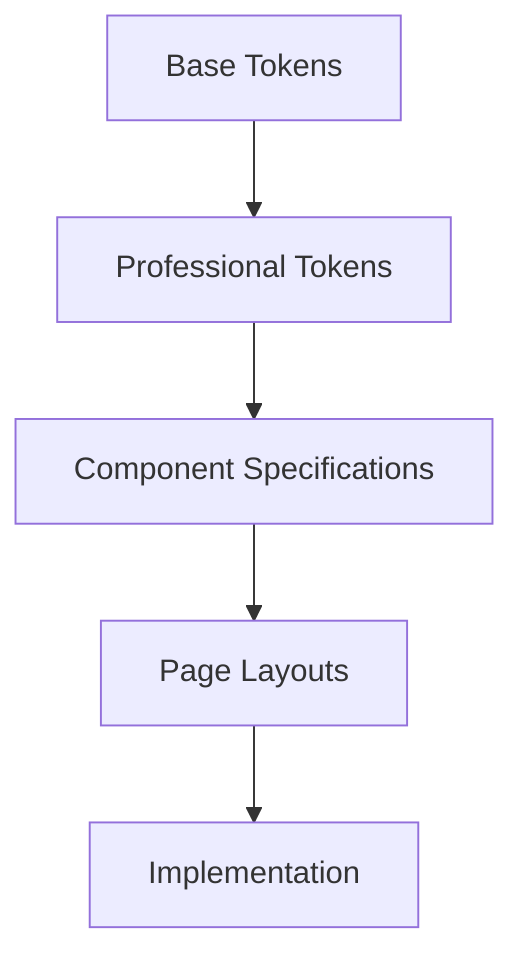

# Professional UI/UX Implementation Guide
# FinTech Application - Industry Standard Design

## Overview

This comprehensive guide provides professional UI/UX design specifications and implementation instructions for the FinTech application, following industry best practices and modern design principles.

---

## Table of Contents

1. [Design Philosophy](#design-philosophy)
2. [Design System Architecture](#design-system-architecture)
3. [Implementation Guide](#implementation-guide)
4. [Component Library](#component-library)
5. [Page Layouts](#page-layouts)
6. [Responsive Design](#responsive-design)
7. [Accessibility Guidelines](#accessibility-guidelines)
8. [Performance Optimization](#performance-optimization)
9. [Testing & Validation](#testing--validation)

---

## Design Philosophy

### Core Principles

1. **Clarity First**: Every element must have a clear purpose and function
2. **Consistency**: Unified design language across all pages and components
3. **Accessibility**: WCAG 2.1 AA compliance as minimum standard
4. **Performance**: Optimized for fast loading and smooth interactions
5. **Responsive**: Seamless experience across all device sizes
6. **Professional**: Enterprise-grade appearance and behavior

### Design Pillars

- **Trust**: Build user confidence through professional, reliable design
- **Simplicity**: Reduce cognitive load with intuitive interfaces
- **Efficiency**: Enable users to complete tasks quickly and accurately
- **Delight**: Subtle animations and micro-interactions that enhance experience

---

## Design System Architecture

### File Structure

```
fintech-main/
├── lib/
│   ├── design-system.ts          # Base design tokens
│   └── design-system-pro.ts      # Professional design tokens
├── styles/
│   ├── globals.css               # Global styles
│   └── pro-design-tokens.css     # CSS custom properties
├── components/
│   ├── ui/                       # UI component library
│   └── layout/                   # Layout components
└── app/
    ├── layout.tsx                # Root layout
    └── page.tsx                  # Home page
```

### Design Token Hierarchy



### Token Types

1. **Primitive Tokens**: Platform-agnostic values (colors, spacing, etc.)
2. **Semantic Tokens**: Purpose-based values (primary, secondary, error)
3. **Component Tokens**: Component-specific values (button, card, input)

---

## Implementation Guide

### Step 1: Setup Design System

#### Import Design Tokens

```typescript
// In your component files
import { ProDesignTokens, ProComponentSpecs } from '@/lib/design-system-pro'

// Usage
const buttonStyle = {
  height: ProDesignTokens.componentSizes.button.height.md,
  padding: `${ProDesignTokens.spacing.sm}px ${ProDesignTokens.spacing.md}px`,
  borderRadius: ProDesignTokens.borderRadius.button,
}
```

#### Use CSS Variables

```css
/* In your CSS files */
@import 'styles/pro-design-tokens.css';

.button {
  height: var(--button-height-md);
  padding: 0 var(--spacing-md);
  border-radius: var(--radius-button);
  background: var(--primary);
  color: var(--primary-foreground);
}
```

### Step 2: Create Base Layout

#### Root Layout Implementation

```tsx
// app/layout.tsx
import type { Metadata } from 'next'
import { Inter } from 'next/font/google'
import './globals.css'
import '@radix-ui/themes/styles.css'
import { ThemeProvider } from '@/components/theme-provider'
import { ProDesignTokens } from '@/lib/design-system-pro'

const inter = Inter({
  subsets: ['latin'],
  variable: '--font-inter',
  display: 'swap',
})

export const metadata: Metadata = {
  title: 'FinTech - Professional Financial Platform',
  description: 'Enterprise-grade financial management solution',
}

export default function RootLayout({
  children,
}: {
  children: React.ReactNode
}) {
  return (
    <html lang="en" className={`${inter.variable}`}>
      <body
        className={`font-sans antialiased ${inter.className}`}
        style={{
          backgroundColor: 'var(--background)',
          color: 'var(--foreground)',
        }}
      >
        <ThemeProvider
          attribute="class"
          defaultTheme="system"
          enableSystem
          disableTransitionOnChange
        >
          <div className="min-h-screen">
            {children}
          </div>
        </ThemeProvider>
      </body>
    </html>
  )
}
```

### Step 3: Implement Global Styles

#### Update globals.css

```css
/* app/globals.css */
@tailwind base;
@tailwind components;
@tailwind utilities;

/* Import professional design tokens */
@import '../styles/pro-design-tokens.css';

/* Base styles */
:root {
  /* Add your theme colors here */
  --background: 0 0% 100%;
  --foreground: 222.2 84% 4.9%;
  --primary: 221.2 83.2% 53.3%;
  --primary-foreground: 210 40% 98%;
  --secondary: 210 40% 96.1%;
  --secondary-foreground: 222.2 47.4% 11.2%;
  --muted: 210 40% 96.1%;
  --muted-foreground: 215.4 16.3% 46.9%;
  --accent: 210 40% 96.1%;
  --accent-foreground: 222.2 47.4% 11.2%;
  --destructive: 0 84.2% 60.2%;
  --destructive-foreground: 210 40% 98%;
  --border: 214.3 31.8% 91.4%;
  --input: 214.3 31.8% 91.4%;
  --ring: 221.2 83.2% 53.3%;
  --radius: 0.5rem;
  --chart-1: 12 76% 61%;
  --chart-2: 173 58% 39%;
  --chart-3: 197 37% 24%;
  --chart-4: 43 74% 66%;
  --chart-5: 27 87% 67%;
}

/* Apply professional typography */
body {
  font-family: var(--font-family-sans);
  font-weight: var(--font-weight-normal);
  line-height: var(--line-height-relaxed);
  color: var(--foreground);
  background: var(--background);
}

/* Smooth scrolling */
html {
  scroll-behavior: smooth;
}

/* Focus visible styles */
*:focus-visible {
  outline: 2px solid var(--ring);
  outline-offset: 2px;
}

/* Custom scrollbar */
::-webkit-scrollbar {
  width: 8px;
  height: 8px;
}

::-webkit-scrollbar-track {
  background: var(--muted);
}

::-webkit-scrollbar-thumb {
  background: var(--muted-foreground);
  border-radius: var(--radius-full);
}

::-webkit-scrollbar-thumb:hover {
  background: var(--foreground);
}

/* Selection */
::selection {
  background: var(--primary);
  color: var(--primary-foreground);
}
```

### Step 4: Create Professional Components

#### Button Component

```tsx
// components/ui/button.tsx
import * as React from "react"
import { Slot } from "@radix-ui/react-slot"
import { cva, type VariantProps } from "class-variance-authority"
import { cn } from "@/lib/utils"
import { ProComponentSpecs } from "@/lib/design-system-pro"

const buttonVariants = cva(
  cn(
    "inline-flex items-center justify-center whitespace-nowrap rounded-md text-sm",
    "font-semibold transition-all duration-200 ease-out",
    "cursor-pointer disabled:pointer-events-none disabled:opacity-50",
    "focus-visible:outline-none focus-visible:ring-2 focus-visible:ring-ring focus-visible:ring-offset-2"
  ),
  {
    variants: {
      variant: {
        default: "bg-primary text-primary-foreground hover:bg-primary/90",
        destructive: "bg-destructive text-destructive-foreground hover:bg-destructive/90",
        outline: "border border-input bg-background hover:bg-accent hover:text-accent-foreground",
        secondary: "bg-secondary text-secondary-foreground hover:bg-secondary/80",
        ghost: "hover:bg-accent hover:text-accent-foreground",
        link: "text-primary underline-offset-4 hover:underline",
      },
      size: {
        default: "h-10 px-4 py-2",
        sm: "h-9 rounded-md px-3",
        lg: "h-11 rounded-md px-8",
      },
    },
    defaultVariants: {
      variant: "default",
      size: "default",
    },
  }
)

export interface ButtonProps
  extends React.ButtonHTMLAttributes<HTMLButtonElement>,
    VariantProps<typeof buttonVariants> {
  asChild?: boolean
}

const Button = React.forwardRef<HTMLButtonElement, ButtonProps>(
  ({ className, variant, size, asChild = false, ...props }, ref) => {
    const Comp = asChild ? Slot : "button"
    return (
      <Comp
        className={cn(buttonVariants({ variant, size, className }))}
        ref={ref}
        {...props}
      />
    )
  }
)
Button.displayName = "Button"

export { Button, buttonVariants }
```

#### Card Component

```tsx
// components/ui/card.tsx
import * as React from "react"
import { cn } from "@/lib/utils"
import { ProDesignTokens } from "@/lib/design-system-pro"

const Card = React.forwardRef<
  HTMLDivElement,
  React.HTMLAttributes<HTMLDivElement>
>(({ className, ...props }, ref) => (
  <div
    ref={ref}
    className={cn(
      "rounded-lg border bg-card text-card-foreground shadow-sm",
      "transition-all duration-200 ease-out",
      className
    )}
    style={{
      borderRadius: ProDesignTokens.borderRadius.card,
      padding: ProDesignTokens.componentSizes.card.padding.md,
    }}
    {...props}
  />
))
Card.displayName = "Card"

const CardHeader = React.forwardRef<
  HTMLDivElement,
  React.HTMLAttributes<HTMLDivElement>
>(({ className, ...props }, ref) => (
  <div
    ref={ref}
    className={cn("flex flex-col space-y-1.5 p-6", className)}
    {...props}
  />
))
CardHeader.displayName = "CardHeader"

const CardTitle = React.forwardRef<
  HTMLParagraphElement,
  React.HTMLAttributes<HTMLParagraphElement>
>(({ className, ...props }, ref) => (
  <h3
    ref={ref}
    className={cn(
      "text-2xl font-semibold leading-none tracking-tight",
      className
    )}
    style={{
      fontSize: ProDesignTokens.typography.scale.heading.h3.mobile,
      fontWeight: ProDesignTokens.typography.fontWeights.semibold,
      lineHeight: ProDesignTokens.typography.lineHeights.normal,
    }}
    {...props}
  />
))
CardTitle.displayName = "CardTitle"

const CardDescription = React.forwardRef<
  HTMLParagraphElement,
  React.HTMLAttributes<HTMLParagraphElement>
>(({ className, ...props }, ref) => (
  <p
    ref={ref}
    className={cn("text-sm text-muted-foreground", className)}
    style={{
      fontSize: ProDesignTokens.typography.scale.body.sm.mobile,
      color: 'var(--muted-foreground)',
    }}
    {...props}
  />
))
CardDescription.displayName = "CardDescription"

const CardContent = React.forwardRef<
  HTMLDivElement,
  React.HTMLAttributes<HTMLDivElement>
>(({ className, ...props }, ref) => (
  <div ref={ref} className={cn("p-6 pt-0", className)} {...props} />
))
CardContent.displayName = "CardContent"

const CardFooter = React.forwardRef<
  HTMLDivElement,
  React.HTMLAttributes<HTMLDivElement>
>(({ className, ...props }, ref) => (
  <div
    ref={ref}
    className={cn("flex items-center p-6 pt-0", className)}
    {...props}
  />
))
CardFooter.displayName = "CardFooter"

export { Card, CardHeader, CardTitle, CardDescription, CardContent, CardFooter }
```

#### Input Component

```tsx
// components/ui/input.tsx
import * as React from "react"
import { cn } from "@/lib/utils"
import { ProDesignTokens } from "@/lib/design-system-pro"

export interface InputProps
  extends React.InputHTMLAttributes<HTMLInputElement> {}

const Input = React.forwardRef<HTMLInputElement, InputProps>(
  ({ className, type, ...props }, ref) => {
    return (
      <input
        type={type}
        className={cn(
          "flex h-10 w-full rounded-md border border-input bg-background px-3 py-2 text-sm ring-offset-background",
          "file:border-0 file:bg-transparent file:text-sm file:font-medium placeholder:text-muted-foreground",
          "focus-visible:outline-none focus-visible:ring-2 focus-visible:ring-ring focus-visible:ring-offset-2",
          "disabled:cursor-not-allowed disabled:opacity-50",
          "transition-all duration-150 ease-out",
          className
        )}
        style={{
          height: ProDesignTokens.componentSizes.input.height.md,
          borderRadius: ProDesignTokens.borderRadius.input,
          padding: `${ProDesignTokens.spacing.md}px ${ProDesignTokens.spacing.md}px`,
          fontSize: ProDesignTokens.typography.scale.body.md.mobile,
        }}
        ref={ref}
        {...props}
      />
    )
  }
)
Input.displayName = "Input"

export { Input }
```

### Step 5: Implement Layout Components

#### Professional Sidebar

```tsx
// components/sidebar.tsx
'use client'

import Link from 'next/link'
import { usePathname } from 'next/navigation'
import { Home, BarChart3, Settings, HelpCircle, Users, FileText, Calculator } from 'lucide-react'
import { cn } from '@/lib/utils'
import { ProDesignTokens } from '@/lib/design-system-pro'

const navItems = [
  { name: 'Dashboard', href: '/', icon: Home },
  { name: 'Analytics', href: '/analytics', icon: BarChart3 },
  { name: 'Statements', href: '/upload', icon: FileText },
  { name: 'AI Assistant', href: '/ai-ca', icon: Users },
  { name: 'Calculators', href: '/calculators', icon: Calculator },
  { name: 'Settings', href: '/settings', icon: Settings },
]

export function Sidebar() {
  const pathname = usePathname()

  return (
    <aside
      className="fixed left-0 top-0 z-40 h-screen w-64 bg-background border-r"
      style={{
        width: ProDesignTokens.layout.sidebar.expanded,
        borderRight: '1px solid var(--border)',
        height: '100vh',
        position: 'fixed',
        zIndex: ProDesignTokens.zIndex.fixed,
      }}
    >
      <div
        className="flex h-full flex-col justify-between p-4"
        style={{
          padding: ProDesignTokens.spacing.md,
        }}
      >
        <div className="space-y-2">
          <div
            className="flex items-center gap-2 px-3 py-2 rounded-lg"
            style={{
              padding: `${ProDesignTokens.spacing.sm}px ${ProDesignTokens.spacing.md}px`,
              borderRadius: ProDesignTokens.borderRadius.lg,
              marginBottom: ProDesignTokens.spacing.md,
            }}
          >
            <div className="w-8 h-8 bg-primary rounded-full flex items-center justify-center">
              <span className="text-primary-foreground font-bold text-sm">F</span>
            </div>
            <span className="font-semibold text-lg">FinTech</span>
          </div>

          <nav className="space-y-1">
            {navItems.map((item) => {
              const isActive = pathname === item.href || pathname.startsWith(`${item.href}/`)

              return (
                <Link
                  key={item.href}
                  href={item.href}
                  className={cn(
                    "flex items-center gap-3 px-3 py-2 rounded-lg transition-all duration-200",
                    isActive
                      ? "bg-primary/10 text-primary font-medium"
                      : "hover:bg-secondary/50 text-muted-foreground hover:text-foreground"
                  )}
                  style={{
                    padding: `${ProDesignTokens.spacing.sm}px ${ProDesignTokens.spacing.md}px`,
                    borderRadius: ProDesignTokens.borderRadius.lg,
                    gap: ProDesignTokens.spacing.sm,
                    transition: `all ${ProDesignTokens.animation.duration.normal}ms ${ProDesignTokens.animation.timing.easeInOut}`,
                  }}
                >
                  <item.icon
                    className="w-5 h-5"
                    style={{
                      width: ProDesignTokens.componentSizes.icon.md,
                      height: ProDesignTokens.componentSizes.icon.md,
                    }}
                  />
                  <span
                    className="font-medium"
                    style={{
                      fontWeight: ProDesignTokens.typography.fontWeights.medium,
                    }}
                  >
                    {item.name}
                  </span>
                </Link>
              )
            })}
          </nav>
        </div>

        <div>
          <Link
            href="/help"
            className="flex items-center gap-3 px-3 py-2 rounded-lg text-muted-foreground hover:bg-secondary/50 hover:text-foreground transition-colors"
            style={{
              padding: `${ProDesignTokens.spacing.sm}px ${ProDesignTokens.spacing.md}px`,
              borderRadius: ProDesignTokens.borderRadius.lg,
              gap: ProDesignTokens.spacing.sm,
              transition: `colors ${ProDesignTokens.animation.duration.normal}ms`,
            }}
          >
            <HelpCircle
              className="w-5 h-5"
              style={{
                width: ProDesignTokens.componentSizes.icon.md,
                height: ProDesignTokens.componentSizes.icon.md,
              }}
            />
            <span className="font-medium">Help & Support</span>
          </Link>
        </div>
      </div>
    </aside>
  )
}
```

#### Professional Header

```tsx
// components/header.tsx
'use client'

import { Bell, Search, User } from 'lucide-react'
import { Input } from '@/components/ui/input'
import { Button } from '@/components/ui/button'
import { ProDesignTokens } from '@/lib/design-system-pro'

export function Header() {
  return (
    <header
      className="sticky top-0 z-30 bg-background/80 backdrop-blur-sm border-b"
      style={{
        height: ProDesignTokens.layout.header.desktop,
        zIndex: ProDesignTokens.zIndex.sticky,
        position: 'sticky',
        borderBottom: '1px solid var(--border)',
      }}
    >
      <div
        className="flex items-center justify-between px-6 py-3"
        style={{
          padding: `${ProDesignTokens.spacing.sm}px ${ProDesignTokens.spacing.xl}px`,
        }}
      >
        <div className="flex items-center gap-4">
          <div className="relative">
            <Search
              className="absolute left-3 top-1/2 -translate-y-1/2 w-4 h-4 text-muted-foreground"
              style={{
                left: ProDesignTokens.spacing.sm,
                width: ProDesignTokens.componentSizes.icon.sm,
                height: ProDesignTokens.componentSizes.icon.sm,
              }}
            />
            <Input
              placeholder="Search..."
              className="pl-10 w-[300px]"
              style={{
                paddingLeft: ProDesignTokens.spacing.xl,
                width: 300,
              }}
            />
          </div>
        </div>

        <div className="flex items-center gap-4">
          <Button
            variant="ghost"
            size="icon"
            className="relative"
            style={{
              width: ProDesignTokens.componentSizes.button.height.md,
              height: ProDesignTokens.componentSizes.button.height.md,
            }}
          >
            <Bell
              className="w-5 h-5"
              style={{
                width: ProDesignTokens.componentSizes.icon.md,
                height: ProDesignTokens.componentSizes.icon.md,
              }}
            />
            <span className="absolute top-1 right-1 w-3 h-3 bg-destructive rounded-full" />
          </Button>

          <Button
            variant="ghost"
            className="flex items-center gap-2"
            style={{
              gap: ProDesignTokens.spacing.sm,
            }}
          >
            <User
              className="w-5 h-5"
              style={{
                width: ProDesignTokens.componentSizes.icon.md,
                height: ProDesignTokens.componentSizes.icon.md,
              }}
            />
            <span className="font-medium">Account</span>
          </Button>
        </div>
      </div>
    </header>
  )
}
```

#### Professional Layout

```tsx
// components/layout.tsx
'use client'

import { Sidebar } from '@/components/sidebar'
import { Header } from '@/components/header'
import { ProDesignTokens } from '@/lib/design-system-pro'

export function Layout({ children }: { children: React.ReactNode }) {
  return (
    <div className="min-h-screen">
      <Sidebar />
      <div
        className="ml-64"
        style={{
          marginLeft: ProDesignTokens.layout.sidebar.expanded,
        }}
      >
        <Header />
        <main
          className="p-6"
          style={{
            padding: ProDesignTokens.spacing.xl,
          }}
        >
          {children}
        </main>
      </div>
    </div>
  )
}
```

---

## Component Library

### UI Components

#### 1. Buttons

**Primary Button**
```tsx
<Button variant="default" size="md">
  Primary Action
</Button>
```

**Secondary Button**
```tsx
<Button variant="secondary" size="md">
  Secondary Action
</Button>
```

**Outline Button**
```tsx
<Button variant="outline" size="md">
  Outline
</Button>
```

**Destructive Button**
```tsx
<Button variant="destructive" size="md">
  Delete
</Button>
```

**Ghost Button**
```tsx
<Button variant="ghost" size="md">
  Ghost
</Button>
```

**Link Button**
```tsx
<Button variant="link" size="md">
  Link
</Button>
```

#### 2. Cards

**Basic Card**
```tsx
<Card>
  <CardHeader>
    <CardTitle>Card Title</CardTitle>
    <CardDescription>Card description goes here</CardDescription>
  </CardHeader>
  <CardContent>
    Card content goes here
  </CardContent>
</Card>
```

**Interactive Card**
```tsx
<Card
  className="cursor-pointer hover:shadow-lg hover:-translate-y-1 transition-all"
>
  <CardHeader>
    <CardTitle>Interactive Card</CardTitle>
  </CardHeader>
  <CardContent>
    Click me for more information
  </CardContent>
</Card>
```

#### 3. Forms

**Form with Input**
```tsx
<form className="space-y-4">
  <div className="space-y-2">
    <label htmlFor="email" className="font-medium">
      Email
    </label>
    <Input
      id="email"
      type="email"
      placeholder="Enter your email"
    />
  </div>
  <Button type="submit" className="w-full">
    Submit
  </Button>
</form>
```

#### 4. Typography

**Headings**
```tsx
<h1 className="text-4xl font-bold leading-tight">Heading 1</h1>
<h2 className="text-3xl font-bold leading-tight">Heading 2</h2>
<h3 className="text-2xl font-semibold leading-normal">Heading 3</h3>
<h4 className="text-xl font-semibold leading-normal">Heading 4</h4>
```

**Body Text**
```tsx
<p className="text-base leading-relaxed">Body text</p>
<p className="text-sm text-muted-foreground">Secondary text</p>
<p className="text-xs text-muted-foreground">Caption text</p>
```

#### 5. Badges/Chips

```tsx
<Badge variant="default">Default</Badge>
<Badge variant="secondary">Secondary</Badge>
<Badge variant="outline">Outline</Badge>
<Badge variant="destructive">Error</Badge>
```

#### 6. Alerts

```tsx
<Alert>
  <AlertDescription>This is a default alert</AlertDescription>
</Alert>

<Alert variant="destructive">
  <AlertDescription>This is an error alert</AlertDescription>
</Alert>
```

#### 7. Dialogs/Modals

```tsx
<Dialog>
  <DialogTrigger asChild>
    <Button>Open Dialog</Button>
  </DialogTrigger>
  <DialogContent>
    <DialogHeader>
      <DialogTitle>Dialog Title</DialogTitle>
      <DialogDescription>Dialog description</DialogDescription>
    </DialogHeader>
    <DialogFooter>
      <Button variant="outline">Cancel</Button>
      <Button>Confirm</Button>
    </DialogFooter>
  </DialogContent>
</Dialog>
```

---

## Page Layouts

### Dashboard Layout

```tsx
// app/page.tsx
import { Layout } from '@/components/layout'
import { Card, CardHeader, CardTitle, CardContent } from '@/components/ui/card'
import { ProDesignTokens } from '@/lib/design-system-pro'

export default function DashboardPage() {
  return (
    <Layout>
      <div className="space-y-6">
        {/* Hero Section */}
        <div>
          <h1 className="text-3xl font-bold">Dashboard</h1>
          <p className="text-muted-foreground mt-1">
            Welcome back! Here's your financial overview.
          </p>
        </div>

        {/* Stats Grid */}
        <div
          className="grid gap-4 md:grid-cols-2 lg:grid-cols-4"
          style={{
            gap: ProDesignTokens.spacing.md,
          }}
        >
          {[
            { title: 'Total Balance', value: '$12,345.67', change: '+12%' },
            { title: 'This Month', value: '$2,345.67', change: '+8%' },
            { title: 'Investments', value: '$8,901.23', change: '+15%' },
            { title: 'Savings', value: '$3,456.78', change: '+5%' },
          ].map((stat, index) => (
            <Card
              key={index}
              className="hover:shadow-md transition-shadow"
              style={{
                borderRadius: ProDesignTokens.borderRadius.card,
              }}
            >
              <CardHeader className="flex flex-row items-center justify-between space-y-0 pb-2">
                <CardTitle className="text-sm font-medium">
                  {stat.title}
                </CardTitle>
                <span className="text-xs text-green-500">{stat.change}</span>
              </CardHeader>
              <CardContent>
                <div className="text-2xl font-bold">{stat.value}</div>
              </CardContent>
            </Card>
          ))}
        </div>

        {/* Main Content Grid */}
        <div
          className="grid gap-4 lg:grid-cols-2"
          style={{
            gap: ProDesignTokens.spacing.md,
          }}
        >
          <Card>
            <CardHeader>
              <CardTitle>Recent Transactions</CardTitle>
            </CardHeader>
            <CardContent>
              {/* Transaction list */}
            </CardContent>
          </Card>

          <Card>
            <CardHeader>
              <CardTitle>Spending Analysis</CardTitle>
            </CardHeader>
            <CardContent>
              {/* Chart component */}
            </CardContent>
          </Card>
        </div>
      </div>
    </Layout>
  )
}
```

### Analytics Page Layout

```tsx
// app/analytics/page.tsx
import { Layout } from '@/components/layout'
import { Card, CardHeader, CardTitle, CardContent } from '@/components/ui/card'
import { Tabs, TabsContent, TabsList, TabsTrigger } from '@/components/ui/tabs'
import { ProDesignTokens } from '@/lib/design-system-pro'

export default function AnalyticsPage() {
  return (
    <Layout>
      <div className="space-y-6">
        <div>
          <h1 className="text-3xl font-bold">Analytics</h1>
          <p className="text-muted-foreground mt-1">
            Detailed insights into your financial data
          </p>
        </div>

        <Tabs defaultValue="overview" className="space-y-4">
          <TabsList>
            <TabsTrigger value="overview">Overview</TabsTrigger>
            <TabsTrigger value="spending">Spending</TabsTrigger>
            <TabsTrigger value="investments">Investments</TabsTrigger>
            <TabsTrigger value="savings">Savings</TabsTrigger>
          </TabsList>

          <TabsContent value="overview" className="space-y-4">
            <div
              className="grid gap-4 md:grid-cols-2"
              style={{
                gap: ProDesignTokens.spacing.md,
              }}
            >
              <Card>
                <CardHeader>
                  <CardTitle>Spending Trends</CardTitle>
                </CardHeader>
                <CardContent>
                  {/* Line chart */}
                </CardContent>
              </Card>

              <Card>
                <CardHeader>
                  <CardTitle>Category Breakdown</CardTitle>
                </CardHeader>
                <CardContent>
                  {/* Pie chart */}
                </CardContent>
              </Card>
            </div>

            <Card>
              <CardHeader>
                <CardTitle>Financial Health</CardTitle>
              </CardHeader>
              <CardContent>
                {/* Health metrics */}
              </CardContent>
            </Card>
          </TabsContent>

          <TabsContent value="spending">
            <Card>
              <CardHeader>
                <CardTitle>Spending Analysis</CardTitle>
              </CardHeader>
              <CardContent>
                {/* Spending content */}
              </CardContent>
            </Card>
          </TabsContent>
        </Tabs>
      </div>
    </Layout>
  )
}
```

### Form Page Layout

```tsx
// app/settings/page.tsx
import { Layout } from '@/components/layout'
import { Card, CardHeader, CardTitle, CardDescription, CardContent, CardFooter } from '@/components/ui/card'
import { Input } from '@/components/ui/input'
import { Label } from '@/components/ui/label'
import { Button } from '@/components/ui/button'
import { ProDesignTokens } from '@/lib/design-system-pro'

export default function SettingsPage() {
  return (
    <Layout>
      <div className="space-y-6">
        <div>
          <h1 className="text-3xl font-bold">Settings</h1>
          <p className="text-muted-foreground mt-1">
            Manage your account preferences
          </p>
        </div>

        <Card>
          <CardHeader>
            <CardTitle>Profile Information</CardTitle>
            <CardDescription>
              Update your personal information
            </CardDescription>
          </CardHeader>
          <CardContent
            className="space-y-4"
            style={{
              gap: ProDesignTokens.spacing.md,
            }}
          >
            <div
              className="space-y-2"
              style={{
                gap: ProDesignTokens.spacing.xs,
              }}
            >
              <Label htmlFor="name">Full Name</Label>
              <Input
                id="name"
                placeholder="John Doe"
                style={{
                  height: ProDesignTokens.componentSizes.input.height.md,
                }}
              />
            </div>

            <div className="space-y-2">
              <Label htmlFor="email">Email Address</Label>
              <Input
                id="email"
                type="email"
                placeholder="john@example.com"
              />
            </div>

            <div className="space-y-2">
              <Label htmlFor="phone">Phone Number</Label>
              <Input
                id="phone"
                type="tel"
                placeholder="+1 (555) 123-4567"
              />
            </div>
          </CardContent>
          <CardFooter>
            <Button>Save Changes</Button>
          </CardFooter>
        </Card>

        <Card>
          <CardHeader>
            <CardTitle>Security Settings</CardTitle>
            <CardDescription>
              Manage your account security
            </CardDescription>
          </CardHeader>
          <CardContent className="space-y-4">
            <div className="space-y-2">
              <Label htmlFor="current-password">Current Password</Label>
              <Input
                id="current-password"
                type="password"
              />
            </div>

            <div className="space-y-2">
              <Label htmlFor="new-password">New Password</Label>
              <Input
                id="new-password"
                type="password"
              />
            </div>

            <div className="space-y-2">
              <Label htmlFor="confirm-password">Confirm New Password</Label>
              <Input
                id="confirm-password"
                type="password"
              />
            </div>
          </CardContent>
          <CardFooter>
            <Button>Update Password</Button>
          </CardFooter>
        </Card>
      </div>
    </Layout>
  )
}
```

---

## Responsive Design

### Breakpoints

```css
/* Mobile-first approach */
@media (min-width: 640px) { /* sm */ }
@media (min-width: 768px) { /* md */ }
@media (min-width: 1024px) { /* lg */ }
@media (min-width: 1280px) { /* xl */ }
@media (min-width: 1536px) { /* 2xl */ }
```

### Responsive Typography

```typescript
// lib/design-system-pro.ts
typography: {
  scale: {
    heading: {
      h1: { mobile: 36, tablet: 48, desktop: 56 },
      h2: { mobile: 30, tablet: 36, desktop: 42 },
      // ...
    }
  }
}
```

### Responsive Layout Patterns

#### 1. Mobile-First Grid

```tsx
// Always mobile by default, then enhance
<div className="grid grid-cols-1 gap-4 md:grid-cols-2 lg:grid-cols-3 xl:grid-cols-4">
  {/* Items */}
</div>
```

#### 2. Responsive Spacing

```tsx
<div className="p-4 md:p-6 lg:p-8">
  {/* Content */}
</div>
```

#### 3. Responsive Text

```tsx
<h1 className="text-2xl md:text-3xl lg:text-4xl font-bold">
  Responsive Heading
</h1>
```

#### 4. Hide/Show Based on Screen Size

```tsx
<div className="hidden md:block">Visible on medium and larger screens</div>
<div className="block md:hidden">Visible on mobile only</div>
```

#### 5. Responsive Images

```tsx
<Image
  src="/image.jpg"
  alt="Description"
  width={1200}
  height={600}
  className="w-full h-auto"
  sizes="(max-width: 768px) 100vw, (max-width: 1200px) 50vw, 33vw"
/>
```

---

## Accessibility Guidelines

### WCAG 2.1 AA Compliance

#### 1. Color Contrast

```typescript
// Minimum contrast ratios
const Accessibility = {
  contrast: {
    minimum: 4.5,  // WCAG AA minimum for normal text
    enhanced: 7,    // WCAG AAA
    largeText: 3,   // For large text (18.66px+ bold, 24px+ regular)
  }
}
```

**Testing Tools:**
- WebAIM Color Contrast Checker
- axe DevTools
- Lighthouse

#### 2. Keyboard Navigation

```tsx
// Ensure all interactive elements are keyboard accessible
<button
  onKeyDown={(e) => {
    if (e.key === 'Enter' || e.key === ' ') {
      // Handle click
    }
  }}
>
  Click me
</button>
```

**Keyboard Requirements:**
- All interactive elements must be focusable
- Focus indicators must be visible
- All functionality must be available via keyboard
- Logical tab order

#### 3. Focus Management

```css
/* Global focus styles */
*:focus-visible {
  outline: 2px solid var(--ring);
  outline-offset: 2px;
  box-shadow: 0 0 0 4px rgba(67, 56, 202, 0.3);
}
```

#### 4. ARIA Attributes

```tsx
// Proper ARIA usage
<div
  role="dialog"
  aria-labelledby="dialog-title"
  aria-describedby="dialog-description"
  aria-modal="true"
>
  <h2 id="dialog-title">Dialog Title</h2>
  <p id="dialog-description">Dialog description</p>
</div>
```

#### 5. Semantic HTML

```tsx
// Use semantic HTML5 elements
<header>...</header>
<nav>...</nav>
<main>...</main>
<article>...</article>
<section>...</section>
<aside>...</aside>
<footer>...</footer>
```

#### 6. Form Accessibility

```tsx
// Proper form labeling
<div>
  <label htmlFor="email">Email Address</label>
  <input
    id="email"
    type="email"
    aria-required="true"
    aria-invalid={hasError}
    aria-describedby={hasError ? 'email-error' : undefined}
  />
  {hasError && (
    <span id="email-error" role="alert">
      Please enter a valid email address
    </span>
  )}
</div>
```

#### 7. Screen Reader Support

```tsx
// Hide content from visual users but make it available to screen readers
function ScreenReaderOnly({ children }: { children: React.ReactNode }) {
  return (
    <span
      className="sr-only"
      style={{
        position: 'absolute',
        width: '1px',
        height: '1px',
        padding: '0',
        margin: '-1px',
        overflow: 'hidden',
        clip: 'rect(0, 0, 0, 0)',
        whiteSpace: 'nowrap',
        border: '0',
      }}
    >
      {children}
    </span>
  )
}
```

#### 8. Touch Targets

```typescript
// Minimum touch target sizes
const Accessibility = {
  touch: {
    minimum: 44,   // 44x44px minimum touch target
    recommended: 48, // 48x48px recommended
  }
}
```

```css
/* Ensure touch targets are large enough */
button, [role="button"], a, [role="link"] {
  min-width: 44px;
  min-height: 44px;
}
```

### Accessibility Testing Checklist

- [ ] Keyboard navigation works correctly
- [ ] Focus indicators are visible
- [ ] All images have alt text
- [ ] All form fields have labels
- [ ] Color contrast meets WCAG AA standards
- [ ] Screen reader testing completed
- [ ] ARIA attributes are properly used
- [ ] Touch targets are at least 44x44px
- [ ] No focus traps
- [ ] Skip links provided for keyboard users

---

## Performance Optimization

### 1. Image Optimization

```tsx
import Image from 'next/image'

// Optimized image component
<Image
  src="/hero-image.jpg"
  alt="FinTech Dashboard"
  width={1200}
  height={600}
  priority={true} // For above-the-fold images
  quality={85}    // Good balance of quality and size
  placeholder="blur" // For blurred placeholder
  blurDataURL="data:image/jpeg;base64,..." // Base64 placeholder
  className="w-full h-auto"
  sizes="(max-width: 768px) 100vw, (max-width: 1200px) 50vw, 33vw"
/>
```

### 2. Font Optimization

```typescript
// Optimize font loading
const inter = Inter({
  subsets: ['latin'],
  variable: '--font-inter',
  display: 'swap', // Show text immediately with fallback, then swap when loaded
  adjustFontFallback: true, // Improve fallback metrics
  fallback: ['system-ui', 'Arial', 'sans-serif'], // Fallback fonts
})
```

### 3. Code Splitting

```tsx
// Dynamic imports for code splitting
import dynamic from 'next/dynamic'

// Load heavy component only when needed
const HeavyChartComponent = dynamic(
  () => import('@/components/heavy-chart'),
  {
    loading: () => <p>Loading...</p>,
    ssr: false, // Disable server-side rendering if not needed
  }
)
```

### 4. Lazy Loading

```tsx
// Lazy load images and components
const LazyImage = dynamic(
  () => import('@/components/lazy-image'),
  { ssr: false }
)

// Use Intersection Observer for lazy loading
useEffect(() => {
  const observer = new IntersectionObserver((entries) => {
    entries.forEach(entry => {
      if (entry.isIntersecting) {
        // Load content
        observer.unobserve(entry.target)
      }
    })
  })

  // Observe elements
  return () => observer.disconnect()
}, [])
```

### 5. Bundle Optimization

```json
// package.json scripts
{
  "scripts": {
    "analyze": "next build && next bundler analyze"
  }
}
```

```bash
# Run bundle analysis
npm run analyze
```

### 6. Performance Metrics

**Target Metrics:**
- First Contentful Paint (FCP): < 1.8s
- Largest Contentful Paint (LCP): < 2.5s
- First Input Delay (FID): < 100ms
- Cumulative Layout Shift (CLS): < 0.1
- Time to Interactive (TTI): < 3.8s

**Monitoring Tools:**
- Lighthouse
- WebPageTest
- Chrome DevTools
- Google Analytics
- New Relic

---

## Testing & Validation

### 1. Design System Testing

```typescript
// test/design-system.test.ts
import { ProDesignTokens, ProComponentSpecs } from '@/lib/design-system-pro'

describe('Design System Tokens', () => {
  it('should have correct spacing values', () => {
    expect(ProDesignTokens.spacing.xs).toBe(8)
    expect(ProDesignTokens.spacing.sm).toBe(12)
    expect(ProDesignTokens.spacing.md).toBe(16)
    expect(ProDesignTokens.spacing.lg).toBe(24)
    expect(ProDesignTokens.spacing.xl).toBe(32)
  })

  it('should have correct typography values', () => {
    expect(ProDesignTokens.typography.fontWeights.normal).toBe(400)
    expect(ProDesignTokens.typography.fontWeights.bold).toBe(700)
    expect(ProDesignTokens.typography.lineHeights.tight).toBe(1.1)
  })

  it('should have correct border radius values', () => {
    expect(ProDesignTokens.borderRadius.md).toBe(8)
    expect(ProDesignTokens.borderRadius.lg).toBe(12)
  })
})
```

### 2. Component Testing

```typescript
// test/components/button.test.tsx
import { render, screen, fireEvent } from '@testing-library/react'
import { Button } from '@/components/ui/button'

describe('Button Component', () => {
  it('renders correctly with default props', () => {
    render(<Button>Click me</Button>)
    expect(screen.getByText('Click me')).toBeInTheDocument()
  })

  it('handles click events', () => {
    const handleClick = jest.fn()
    render(<Button onClick={handleClick}>Click me</Button>)

    fireEvent.click(screen.getByText('Click me'))
    expect(handleClick).toHaveBeenCalledTimes(1)
  })

  it('applies correct styles for variants', () => {
    const { rerender } = render(<Button variant="default">Default</Button>)
    expect(screen.getByText('Default')).toHaveClass('bg-primary')

    rerender(<Button variant="secondary">Secondary</Button>)
    expect(screen.getByText('Secondary')).toHaveClass('bg-secondary')
  })
})
```

### 3. Visual Regression Testing

```typescript
// visual-regression.config.js
module.exports = {
  backstop: {
    id: 'fintech_app',
    viewports: [
      { label: 'phone', width: 375, height: 667 },
      { label: 'tablet', width: 768, height: 1024 },
      { label: 'desktop', width: 1440, height: 900 },
    ],
    scenarios: [
      {
        label: 'Dashboard',
        url: 'http://localhost:3000',
        selectors: ['document'],
      },
    ],
    paths: {
      bitmaps_reference: 'backstop_data/bitmaps_reference',
      bitmaps_test: 'backstop_data/bitmaps_test',
    },
  },
}
```

### 4. Cross-Browser Testing

**Supported Browsers:**
- Chrome (latest 2 versions)
- Firefox (latest 2 versions)
- Safari (latest 2 versions)
- Edge (latest 2 versions)
- Opera (latest version)

**Testing Tools:**
- BrowserStack
- Sauce Labs
- LambdaTest
- CrossBrowserTesting.com

### 5. Mobile Testing

**Mobile Testing Checklist:**
- [ ] Responsive layout works on all screen sizes
- [ ] Touch targets are large enough
- [ ] Form inputs work on mobile
- [ ] Scrolling behaves correctly
- [ ] Native mobile features work (camera, location, etc.)
- [ ] Performance is acceptable on mobile devices
- [ ] Battery usage is reasonable

**Mobile Testing Tools:**
- Chrome DevTools Device Mode
- Xcode Simulator
- Android Studio Emulator
- Real devices (various iOS and Android versions)

---

## Deployment & Maintenance

### 1. CI/CD Pipeline

```yaml
# .github/workflows/deploy.yml
name: Deploy

on:
  push:
    branches: [main]

jobs:
  test:
    runs-on: ubuntu-latest
    steps:
      - uses: actions/checkout@v3
      - uses: actions/setup-node@v3
        with:
          node-version: '18'
      - run: npm ci
      - run: npm run lint
      - run: npm run test
      - run: npm run build

  deploy:
    needs: test
    runs-on: ubuntu-latest
    steps:
      - uses: actions/checkout@v3
      - uses: actions/setup-node@v3
        with:
          node-version: '18'
      - run: npm ci
      - run: npm run build
      - run: npm run deploy
```

### 2. Monitoring

```typescript
// server/lib/monitoring/logger.ts
import { pino } from 'pino'

const logger = pino({
  level: process.env.NODE_ENV === 'production' ? 'info' : 'debug',
  formatters: {
    level: (label) => ({ level: label }),
    log: (object) => ({
      ...object,
      timestamp: new Date().toISOString(),
    }),
  },
  transport: {
    targets: [
      { target: 'pino-http', level: 'info' },
      { target: 'pino/file', options: { destination: '/var/log/fintech/app.log' } },
    ],
  },
})

export { logger }
```

### 3. Error Tracking

```typescript
// server/lib/monitoring/error-tracker.ts
import * as Sentry from '@sentry/node'
import { ProDesignTokens } from '@/lib/design-system-pro'

if (process.env.NODE_ENV === 'production') {
  Sentry.init({
    dsn: process.env.SENTRY_DSN,
    tracesSampleRate: 1.0,
    release: `fintech@${process.env.npm_package_version}`,
    environment: process.env.NODE_ENV,
    integrations: [
      new Sentry.Integrations.Http({ tracing: true }),
      new Sentry.Integrations.Express({ app: expressApp }),
    ],
  })
}

export function captureError(error: Error, context: Record<string, any> = {}) {
  Sentry.captureException(error, { extra: context })
}

export function captureMessage(message: string, context: Record<string, any> = {}) {
  Sentry.captureMessage(message, { extra: context })
}
```

### 4. Performance Monitoring

```typescript
// server/lib/monitoring/performance.ts
import { performance } from 'perf_hooks'

export function measurePerformance<T>(
  name: string,
  fn: () => T
): T {
  const start = performance.now()
  const result = fn()
  const end = performance.now()

  const duration = end - start
  // Log or send to monitoring service
  console.log(`[Performance] ${name}: ${duration.toFixed(2)}ms`)

  return result
}
```

---

## Best Practices

### 1. Design System Maintenance

- **Regular Audits**: Review design tokens and components quarterly
- **Documentation**: Keep documentation up to date
- **Versioning**: Use semantic versioning for design system changes
- **Changelog**: Maintain a changelog for design system updates
- **Deprecation**: Clearly communicate deprecations with migration paths

### 2. Component Development

- **Single Responsibility**: Each component should do one thing well
- **Composition**: Favor composition over inheritance
- **Props Validation**: Use TypeScript for type safety
- **Accessibility**: Build accessibility in from the start
- **Performance**: Optimize for performance in component design

### 3. Code Quality

- **Consistent Naming**: Use consistent naming conventions
- **Code Formatting**: Use Prettier for consistent formatting
- **Linting**: Use ESLint for code quality
- **Type Checking**: Use TypeScript for type safety
- **Testing**: Write comprehensive tests

### 4. Collaboration

- **Design Handoff**: Use tools like Figma for design handoff
- **Code Reviews**: Conduct thorough code reviews
- **Pair Programming**: Use pair programming for complex features
- **Documentation**: Document decisions and changes
- **Communication**: Maintain clear communication channels

---

## Resources

### Design Tools
- [Figma](https://www.figma.com/) - UI/UX Design
- [Adobe XD](https://www.adobe.com/products/xd.html) - UI/UX Design
- [Sketch](https://www.sketch.com/) - UI/UX Design
- [Whimsical](https://whimsical.com/) - Flowcharts and Wireframes

### Development Tools
- [Next.js](https://nextjs.org/) - React Framework
- [Tailwind CSS](https://tailwindcss.com/) - CSS Framework
- [Radix UI](https://www.radix-ui.com/) - UI Components
- [shadcn/ui](https://ui.shadcn.com/) - UI Component Library
- [Storybook](https://storybook.js.org/) - Component Documentation

### Testing Tools
- [Jest](https://jestjs.io/) - JavaScript Testing
- [React Testing Library](https://testing-library.com/docs/react-testing-library/intro/) - React Testing
- [Cypress](https://www.cypress.io/) - E2E Testing
- [Playwright](https://playwright.dev/) - E2E Testing
- [Lighthouse](https://developer.chrome.com/docs/lighthouse/overview/) - Performance Testing

### Accessibility Tools
- [axe DevTools](https://www.deque.com/axe/) - Accessibility Testing
- [WAVE](https://wave.webaim.org/) - Accessibility Evaluation
- [WebAIM Color Contrast Checker](https://webaim.org/resources/contrastchecker/) - Color Contrast
- [NVDA](https://www.nvaccess.org/) - Screen Reader
- [VoiceOver](https://support.apple.com/guide/voiceover/welcome/mac) - Screen Reader

### Performance Tools
- [WebPageTest](https://www.webpagetest.org/) - Performance Testing
- [Google PageSpeed Insights](https://pagespeed.web.dev/) - Performance Analysis
- [Lighthouse](https://developer.chrome.com/docs/lighthouse/overview/) - Performance Auditing
- [New Relic](https://newrelic.com/) - Application Monitoring
- [Sentry](https://sentry.io/) - Error Tracking

---

## Conclusion

This comprehensive UI/UX implementation guide provides everything you need to create a professional, industry-standard FinTech application. By following the design system, component library, and best practices outlined in this document, you can build a high-quality application that meets modern web standards.

**Key Takeaways:**
1. Use the design system tokens consistently
2. Follow the component specifications for professional results
3. Prioritize accessibility and performance
4. Test thoroughly across devices and browsers
5. Maintain clear documentation and communication

**Next Steps:**
1. Implement the design system in your project
2. Create or update components using the specifications
3. Apply the layout patterns to your pages
4. Test and validate your implementation
5. Iterate and improve based on feedback

By following this guide, you'll create a FinTech application that looks and feels professional, performs well, and provides an excellent user experience across all devices.