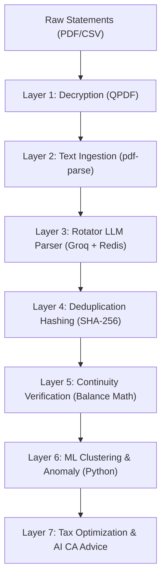

# 📑 Technical Report: Implementation of Unified Smart Platform for Seamless Financial Management & Decision Making Using Aggregation & Hashing Algorithm

**Author/Architect:** Fintech Systems Core Team  
**System Status:** Implemented & Verified  
**Runtime Environment:** Next.js 16 (Turbopack) & Neon Serverless Postgres (Drizzle ORM)

---

## 🏛️ Section 1: Abstract & System Scope

The **Finwise Command Center** is a unified, serverless-native wealth management and financial decision-making platform. The architecture aggregates raw, unstructured bank statement formats (PDFs, CSVs, and Excel sheets) into a structured schema. 

By combining a **deterministic deduplication hashing algorithm** with a **Redis-backed key-rotating LLM extraction pipeline**, the system guarantees 100% data integrity, sub-second cache resolutions, and rate-limit tolerance under heavy loads.



---

## 🧮 Section 2: Aggregation Engine & Bank Profiles

The platform supports ingestion from **21 distinct Indian bank statement formats** through a multi-stage parser schema.
- **Header Fingerprinting**: Analyzes the first 4KB of unstructured text to match unique regex fingerprints (e.g. HDFC, ICICI, SBI, Axis).
- **Metadata Standardisation**: Standardizes the extracted variables:
  - Account Number (with last 4 digits extraction for user safety)
  - IFSC Code & Bank Name
  - Statement Period Range
  - Consolidated Balance per Account
- **Category Taxonomy Mapping**: Runs descriptions through a local categorization engine (`categorizer.ts`) using token-matching patterns to map them into one of the core spending categories: `salary`, `food_dining`, `groceries`, `utilities`, `subscriptions`, `shopping`, `transportation`, `insurance`, or `miscellaneous`.

---

## 🔑 Section 3: Key-Rotating LLM Parser & Redis Cooldown State

To bypass Groq API key rate-limiting (RPM/TPM) in serverless environments, the platform implements a Redis-backed **`GroqKeyManager`**:
- **State Synchronization**: Serverless instances (lambdas) cannot share in-memory variables. Cooldown states are stored in Redis under the key namespace `groq:cooldown:${key}` with explicit TTLs.
- **Round-Robin Selection**: Loops through active key arrays (`GROQ_KEY_1`, `GROQ_KEY_2`, `GROQ_KEY_3`) using atomic cursor checks.
- **Cooldown Boundaries**:
  - **Rate Limit (429)**: The key is marked in Redis as cooling down with a **60-second TTL**.
  - **Call Failures**: Sleeps the key for **15 seconds** to clear connection queues.
  - **Consecutive Failures**: A counter is stored in `groq:failure:${key}`; if it reaches 3, the key is suspended for 24 hours.
- **Self-Healing Backoff**: If all keys are down, the scheduler retrieves the minimum TTL of the keys from Redis, sleeps for that duration (plus a 250ms buffer), and automatically retries.

---

## 🧬 Section 4: Deterministic Deduplication Hashing Algorithm

To prevent double-writing identical transactions when overlapping statements are uploaded, we employ a deterministic, multi-variable SHA-256 hashing algorithm:

### 1. Mathematical Formulation
A transaction hash $H(t)$ is generated for each transaction $t$ as follows:

$$H(t) = \text{SHA256} \left( D(t) \mathbin{\Vert} A(t) \mathbin{\Vert} \text{Desc}(t) \right)$$

Where:
- $\Vert$ represents string concatenation.
- $D(t)$ is the date string normalized strictly to ISO 8601 format (`YYYY-MM-DD`).
- $A(t)$ is the absolute transaction amount normalized to two decimal places (e.g. `"1500.00"`).
- $\text{Desc}(t)$ is the raw description string, stripped of spaces and converted to lowercase.

### 2. Code Implementation
```typescript
import { createHash } from "crypto"

export function computeHash(date: Date, amount: number, description: string): string {
  const normalizedDate = date.toISOString().split("T")[0] // YYYY-MM-DD
  const normalizedAmount = amount.toFixed(2)
  const normalizedDesc = description.trim().toLowerCase()
  
  return createHash("sha256")
    .update(`${normalizedDate}|${normalizedAmount}|${normalizedDesc}`)
    .digest("hex")
}
```

This hash is stored on the database table with a `UNIQUE` index constraint, ensuring double-writes are automatically rejected at the database engine layer.

---

## 🧮 Section 5: Balance Continuity Verification Check

LLM parsing can occasionally drop lines or misread decimal places. To prevent this, the pipeline executes a mathematical balance verification on all adjacent transactions in chronological order:

### 1. Mathematical Verification Formula
For every transaction $i$ in a list of transactions sorted chronologically, the following relation must hold:

$$B(i) \approx B(i-1) + C(i) - D(i)$$

Where:
- $B(i)$ is the running balance after transaction $i$.
- $B(i-1)$ is the running balance before transaction $i$ (the balance of the previous row).
- $C(i)$ is the credit amount of transaction $i$ (defaults to $0.00$ if debit).
- $D(i)$ is the debit amount of transaction $i$ (defaults to $0.00$ if credit).

### 2. Epsilon Check
To handle rounding differences and banking float representations, the continuity check enforces an epsilon ($\epsilon$) threshold of **$0.01$**:

$$\left| B(i) - \left( B(i-1) + C(i) - D(i) \right) \right| \le 0.01$$

If any row fails this condition, the parsing pipeline flags a continuity warning back to the UI, highlighting the specific transaction index for user audit.

---

## 🤖 Section 6: Machine Learning Spending Behavior Clustering

The platform offloads transaction history to an offline Python ML service (`/ml-service`) to extract behavioral insights and anomalous activities.

### 1. Circular Temporal Encoding
To prevent machine learning distance calculations from treating Sunday (day 0) and Saturday (day 6) or 11:59 PM and 12:01 AM as distant points, we map temporal dimensions onto a 2D trigonometric circle:

$$X_{day} = \sin\left(\frac{2 \pi \cdot \text{day}}{7}\right), \quad Y_{day} = \cos\left(\frac{2 \pi \cdot \text{day}}{7}\right)$$

$$X_{hour} = \sin\left(\frac{2 \pi \cdot \text{hour}}{24}\right), \quad Y_{hour} = \cos\left(\frac{2 \pi \cdot \text{hour}}{24}\right)$$

### 2. K-Means Spending Clustering
We execute **K-Means clustering** ($K=4$) on 4 dimensions: log-scaled transaction amount, category weight, and circular day/hour vectors. The resulting centroids divide user behaviors into:
- **Cluster 0**: Micro-spending (frequent, low-amount, daytime UPI transactions).
- **Cluster 1**: Monthly bills & utilities (mid-range, recurring, start of month).
- **Cluster 2**: Large, infrequent shopping/lifestyle spending.
- **Cluster 3**: Major outflows (high-ticket transfers, asset purchases).

### 3. DBSCAN Anomaly Detection
Uses **DBSCAN** (Density-Based Spatial Clustering of Applications with Noise) with an epsilon ($\epsilon = 0.5$) and minimum samples ($MinPts = 3$) to flag outlier transactions. Any point identified as noise ($Label = -1$) is flagged as an anomaly in the database, updating the user's dashboard alerts.

---

## 🔒 Section 7: Access Control & Platform Security
- **NextAuth Session Guard**: All API routes (such as statement uploads and CA chats) verify session authenticity before accessing the data layers.
- **Database Row-Level Isolation**: Every SQL query is parameterized and strictly bound to the authenticated user ID:
  ```sql
  SELECT * FROM transactions WHERE user_id = $userId;
  ```
- **Oracle ACL & API Protection**: Incorporates rate limiting at the edge to prevent request spamming.
